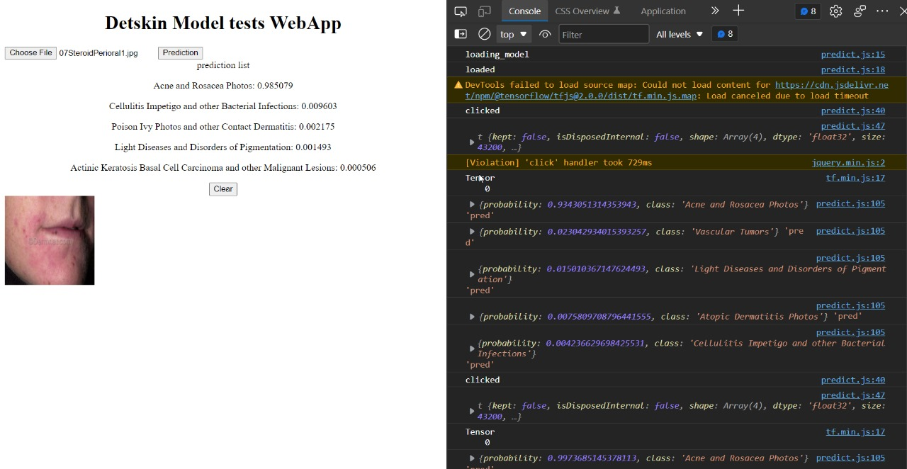

# ml-model

## In this page you can find the Demo file in which you can setup a server and find the prediction for the m=image that you provide 
# Setup the server

## Redirect to the local-server folder and execute the following command
## To install the required packages
`npm install node_modules`

## then after installing the required packages run the server by the command

`node server.js`
## Then open a browser and browse `127.0.0.1:8100`

Then you will see the interface like this

